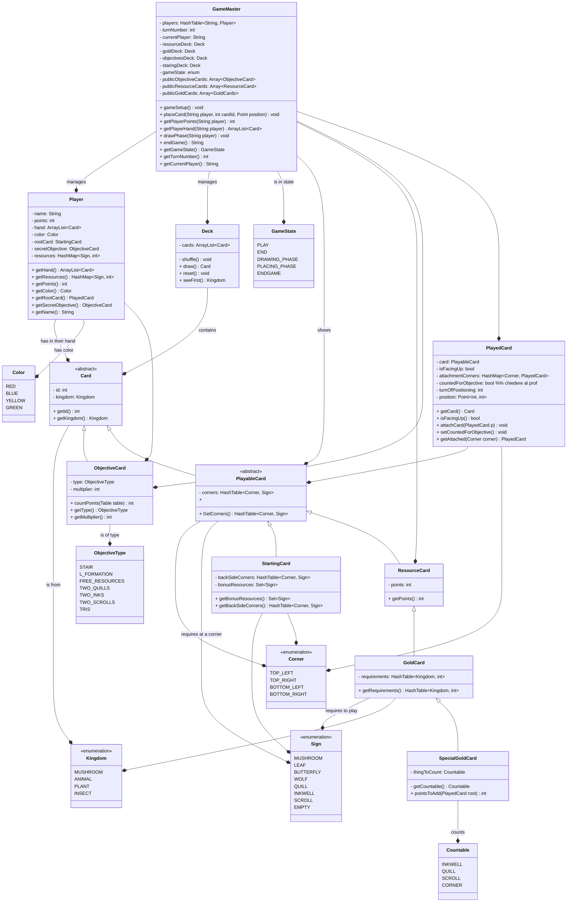

# Model UML

## Cose da chiedere

- Dobbiamo fare partite consecutive?
- Va bene usare solo `GameMaster` per interfacciarsi con il controller?
- Si può vedere la mano degli avversari? Solo un lato?
- Come gestiamo il mandare in giro il grafo con le carte piazzate?
- Lobby?
- Gigantesco switch o implementiamo un interfaccia per le enumerazioni??
- Gerarchia di enumerazioni?

