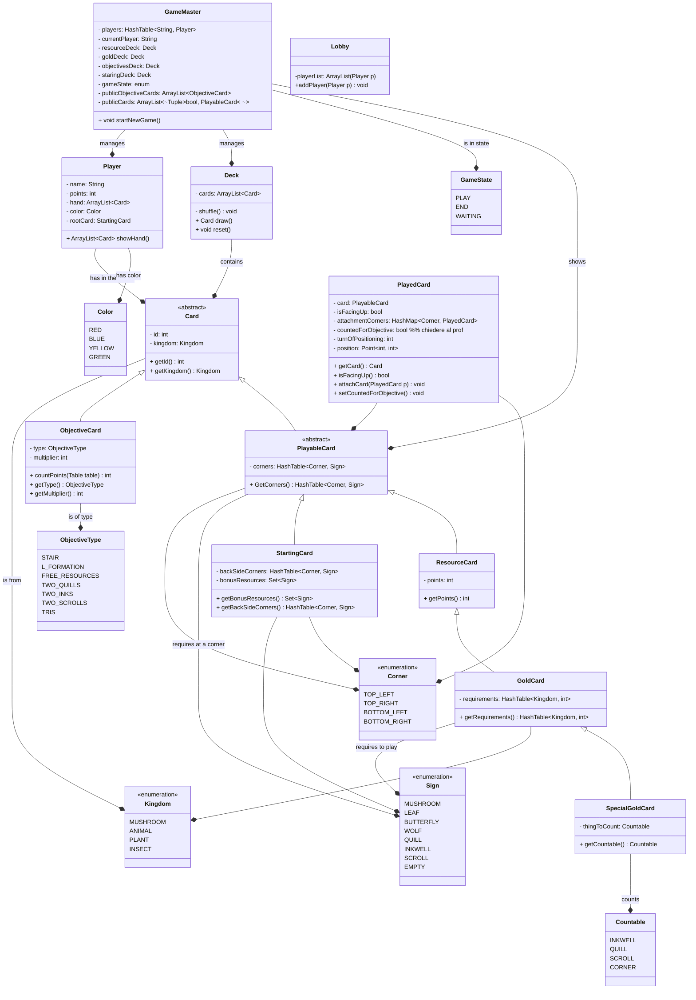

# Model UML

## Cose da chiedere

- Dobbiamo fare partite consecutive?

```mermaid
classDiagram

    class Kingdom {
        <<enumeration>>
        MUSHROOM
        ANIMAL
        PLANT
        INSECT
    }

    class Sign {
        <<enumeration>>
        MUSHROOM
        LEAF
        BUTTERFLY
        WOLF
        QUILL        
        INKWELL
        SCROLL
        EMPTY
    }

    class Color {
        RED
        BLUE
        YELLOW
        GREEN
    }

    class Card {
        <<abstract>>
        - id: int
        - kingdom: Kingdom
        + getId() int
        + getKingdom() Kingdom
    }

    Card --* Kingdom : is from

    class ObjectiveType {
        STAIR
        L_FORMATION
        FREE_RESOURCES
        TWO_QUILLS
        TWO_INKS
        TWO_SCROLLS
        TRIS

    }

    class ObjectiveCard {
        - type: ObjectiveType
        - multiplier: int

        + countPoints(Table table) int
        + getType() ObjectiveType
        + getMultiplier() int
    }

    ObjectiveCard --* ObjectiveType : is of type 

    class Corner {
        <<enumeration>>
        TOP_LEFT
        TOP_RIGHT
        BOTTOM_LEFT
        BOTTOM_RIGHT
    }

    class PlayableCard {
        <<abstract>>
        - corners: HashTable~Corner, Sign~

        + GetCorners() HashTable~Corner, Sign~
    }

    PlayableCard --* Corner
    PlayableCard --* Sign : requires at a corner

    class StartingCard {
        - backSideCorners: HashTable~Corner, Sign~
        - bonusResources: Set~Sign~

        + getBonusResources() Set~Sign~
        + getBackSideCorners() HashTable~Corner, Sign~
    }

    StartingCard --* Sign
    StartingCard --* Corner


    class ResourceCard {
        - points: int

        + getPoints() int
    }

    class GoldCard {
        - requirements: HashTable~Kingdom, int~

        + getRequirements() HashTable~Kingdom, int~
    }

    GoldCard --* Sign : requires to play
    GoldCard --* Kingdom

    class SpecialGoldCard {
        - thingToCount: Countable

        + getCountable() Countable
    }

    SpecialGoldCard --* Countable : counts

    Card <|-- ObjectiveCard
    Card <|-- PlayableCard
    PlayableCard <|-- StartingCard
    PlayableCard <|-- ResourceCard
    ResourceCard <|-- GoldCard
    GoldCard <|-- SpecialGoldCard

    class Deck {
        - cards: ArrayList~Card~
        - shuffle() void
        + Card draw()
        + void reset() 
    }

    Deck --* Card : contains

    class Player {
        - name: String
        - points: int
        - hand: ArrayList~Card~
        - color: Color
        - rootCard: StartingCard 

        + ArrayList~Card~ showHand() 
    }

    Player --* Card : has in their hand 
    Player --* Color : has color

    class GameState {
        PLAY
        END
        WAITING
    }

    class GameMaster {
        - players: HashTable~String, Player~
        - currentPlayer: String
        - resourceDeck: Deck
        - goldDeck: Deck
        - objectivesDeck: Deck
        - staringDeck: Deck
        - gameState: enum
        - publicObjectiveCards: ArrayList~ObjectiveCard~
        - publicCards: ArrayList~~Tuple~bool, PlayableCard~ ~~

        + void startNewGame()
    }

    GameMaster --* Player : manages
    GameMaster --* Deck : manages
    GameMaster --* GameState : is in state
    GameMaster --* PlayableCard : shows

    class Countable {
        INKWELL
        QUILL
        SCROLL
        CORNER
    }

    class PlayedCard {
        - card: PlayableCard
        - isFacingUp: bool
        - attachmentCorners: HashMap~Corner, PlayedCard~
        - countedForObjective: bool %% chiedere al prof
        - turnOfPositioning: int
        - position: Point~int, int~

        + getCard() Card
        + isFacingUp() bool
        + attachCard(PlayedCard p) void
        + setCountedForObjective() void
        
    }

    class Lobby {
        -playerList: ArrayList(Player p)

        +addPlayer(Player p) void
    }

    PlayedCard --* PlayableCard
    PlayedCard --* Corner
```
