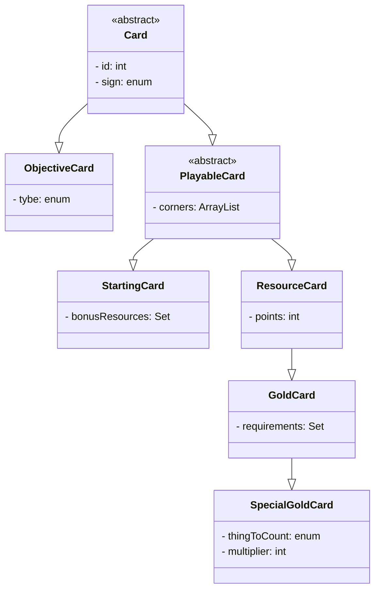

# Model UML

```mermaid
classDiagram
    class Card {
        <<abstract>>
        - id: int
        - sign: enum
    }
    class ObjectiveCard {
        - tybe: enum
    }
    class PlayableCard {
        <<abstract>>
        - corners: ArrayList
    }

    class StartingCard {
        - bonusResources: Set
    }

    class ResourceCard {
        - points: int 
    }

    class GoldCard {
        - requirements: Set
    }

    class SpecialGoldCard {
        - thingToCount: enum
        - multiplier: int
    }

    Card --|> ObjectiveCard
    Card --|> PlayableCard
    PlayableCard --|> StartingCard
    PlayableCard --|> ResourceCard
    ResourceCard --|> GoldCard
    GoldCard --|> SpecialGoldCard
```
