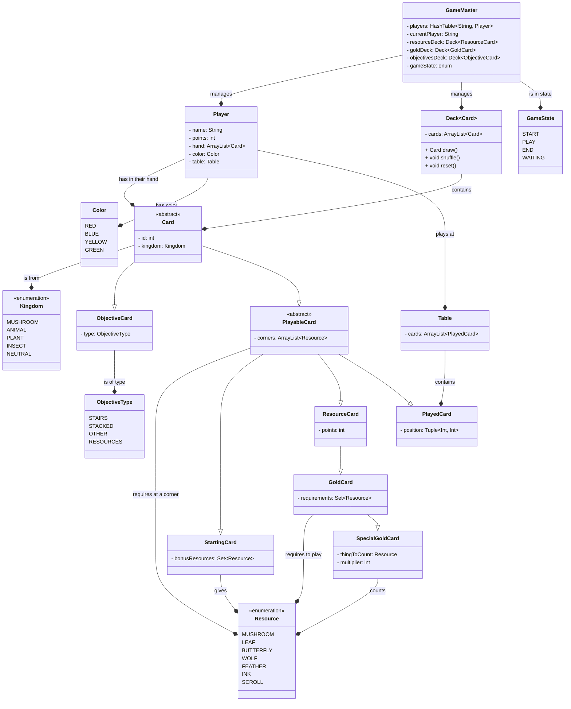

# Model UML

```mermaid
classDiagram

    class Kingdom {
        <<enumeration>>
        MUSHROOM
        ANIMAL
        PLANT
        INSECT
        NEUTRAL
    }

    class Resource {
        <<enumeration>>
        MUSHROOM
        LEAF
        BUTTERFLY
        WOLF
        FEATHER
        INK
        SCROLL
    }

    class Color {
        RED
        BLUE
        YELLOW
        GREEN
    }

    class Card {
        <<abstract>>
        - id: int
        - kingdom: Kingdom
    }

    Card --* Kingdom : is from

    class ObjectiveType {
        STAIRS
        STACKED
        OTHER
        RESOURCES
    }

    class ObjectiveCard {
        - type: ObjectiveType
    }

    ObjectiveCard --* ObjectiveType : is of type 

    %% Non sono sicuro di come rappresentarli.
    class PlayableCard {
        <<abstract>>
        - corners: ArrayList~Resource~ 
    }

    PlayableCard --* Resource : requires at a corner

    class StartingCard {
        - bonusResources: Set~Resource~
    }

    StartingCard --* Resource : gives

    class ResourceCard {
        - points: int 
    }

    class GoldCard {
        - requirements: Set~Resource~
    }

    GoldCard --* Resource : requires to play

    class SpecialGoldCard {
        - thingToCount: Resource
        - multiplier: int
    }

    SpecialGoldCard --* Resource : counts

    Card --|> ObjectiveCard
    Card --|> PlayableCard
    PlayableCard --|> StartingCard
    PlayableCard --|> ResourceCard
    ResourceCard --|> GoldCard
    GoldCard --|> SpecialGoldCard

    class Deck~Card~ {
        - cards: ArrayList~Card~
        + Card draw()
        + void shuffle()
        + void reset()
    }

    Deck --* Card : contains

    class Player {
        - name: String
        - points: int
        - hand: ArrayList~Card~
        - color: Color
        - table: Table
    }

    Player --* Card : has in their hand 
    Player --* Color : has color

    class Table {
        - cards: ArrayList~PlayedCard~
    }

    Player --* Table : plays at

    class GameState {
        START
        PLAY
        END
        WAITING
    }

    class GameMaster {
        - players: HashTable~String, Player~
        - currentPlayer: String
        - resourceDeck: Deck~ResourceCard~
        - goldDeck: Deck~GoldCard~
        - objectivesDeck: Deck~ObjectiveCard~
        - gameState: enum
    }

    GameMaster --* Player : manages
    GameMaster --* Deck : manages
    GameMaster --* GameState : is in state

    class PlayedCard {
        - position: Tuple~Int, Int~
    }

    Table --* PlayedCard : contains
    PlayableCard --|> PlayedCard

```
