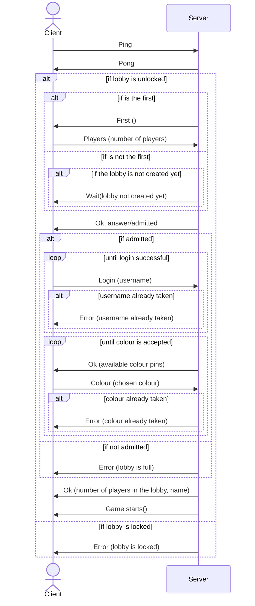
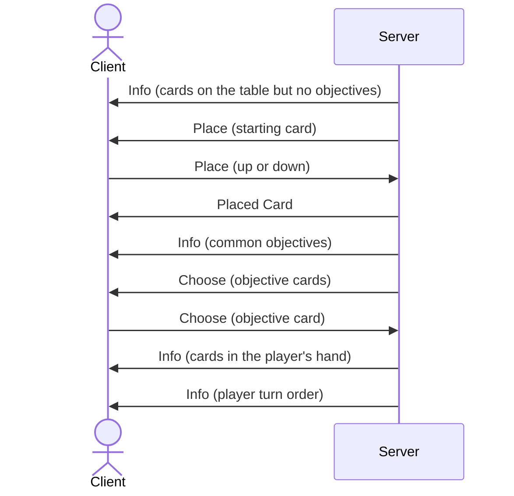
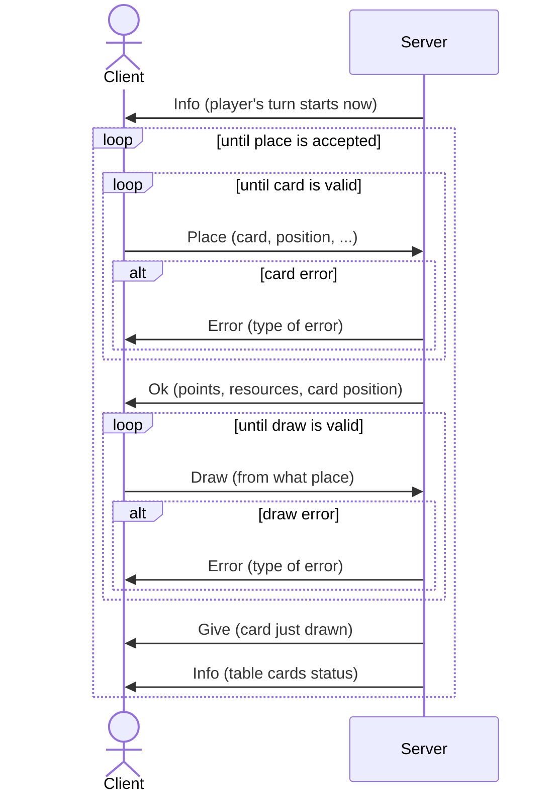
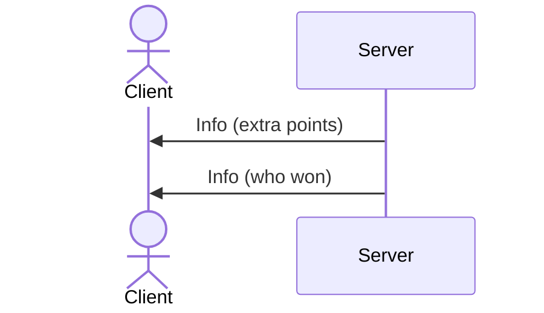

# Connection diagrams

## Login

## Game Start

## Game Flow

## End Game

During the end game, the turns are the same as in the game flow, just the server must notify the players of the fact that the game is about to end.

