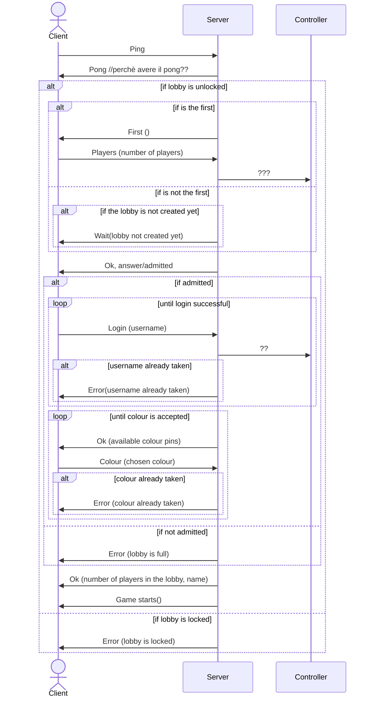
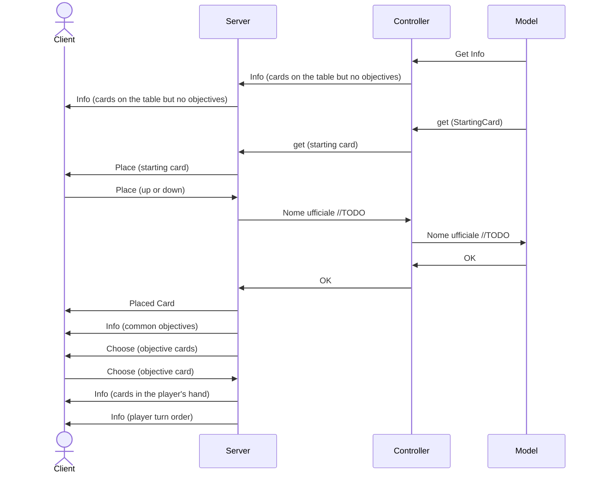
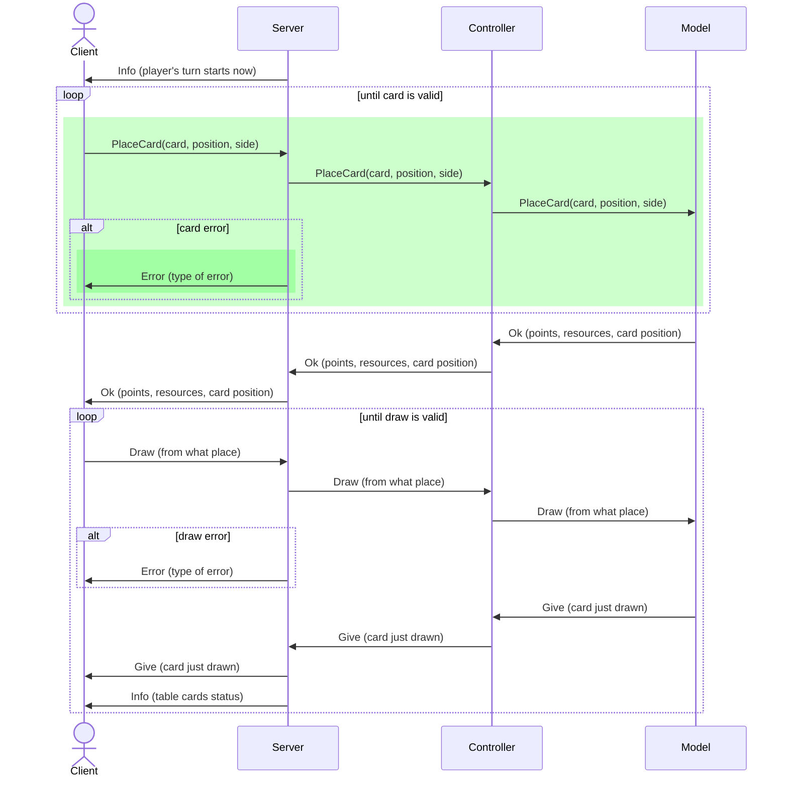
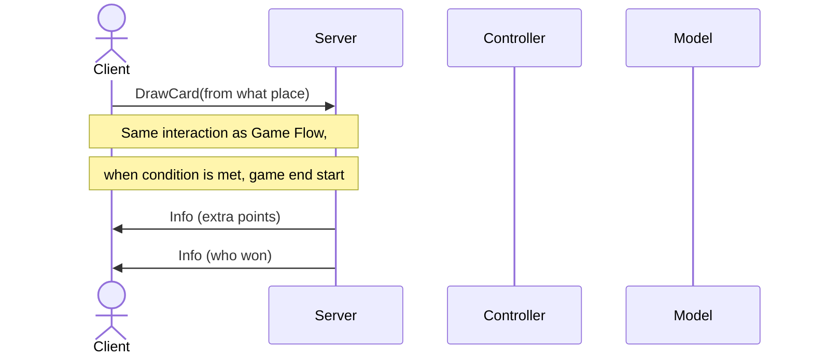

# Connection diagrams

## Login
Login phase illustrates the interaction between the client and the server when a player wants to join a lobby. The server must check if the lobby is unlocked and if the player is the first to join. If the lobby is unlocked and the player is the first, the server must create the lobby and wait for the other players to join. If the lobby is unlocked and the player is not the first, the server must wait for the lobby to be created. If the lobby is locked, the server must notify the client that the lobby is locked. If the player is admitted to the lobby, the server must wait for the player to log in and choose a colour. If the player is not admitted to the lobby, the server must notify the client that the lobby is full.

## Game Start

//ricontrollare game start

## Game Flow

## End Game

During the end game, the turns are the same as in the game flow, just the server must notify the players of the fact that the game is about to end.

