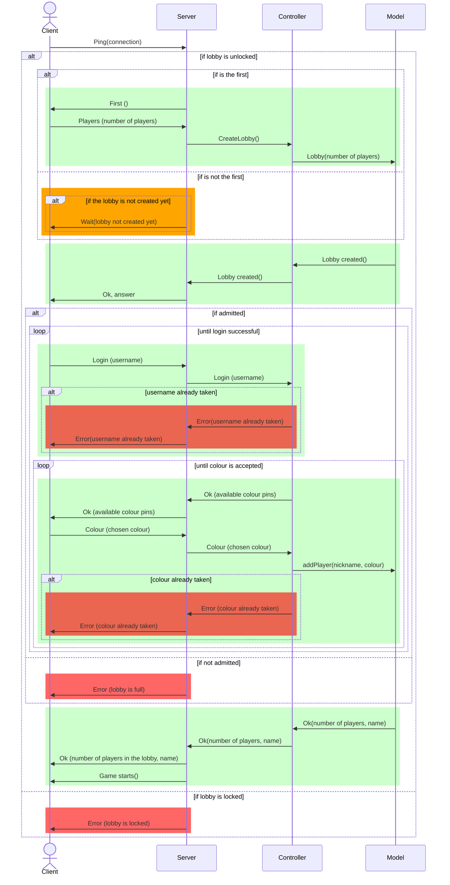
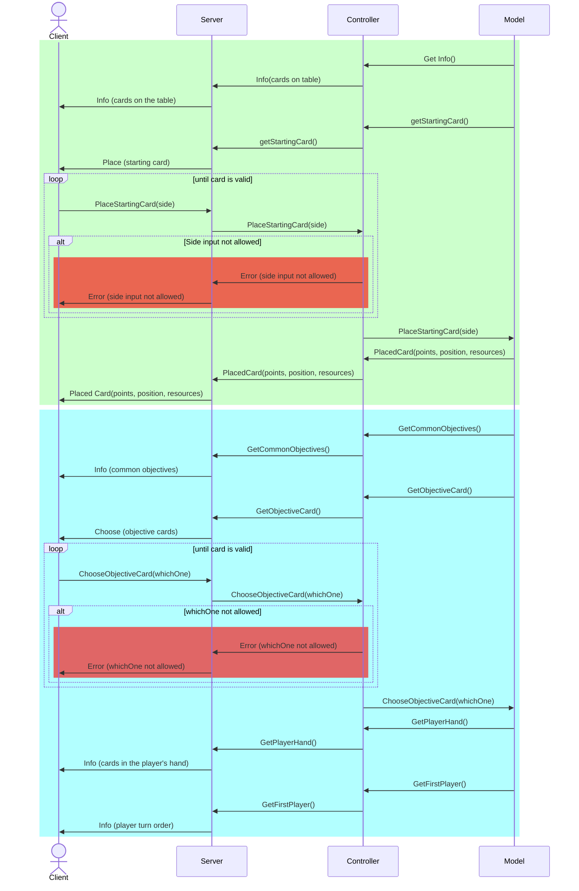
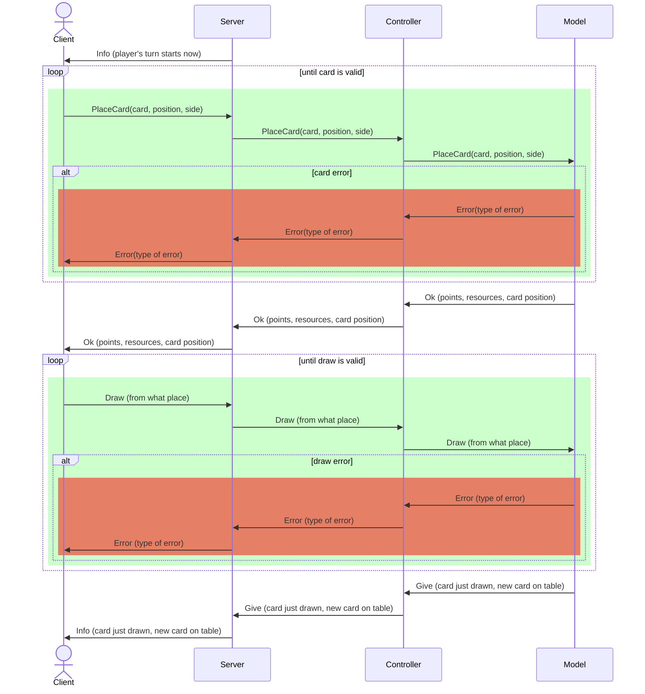
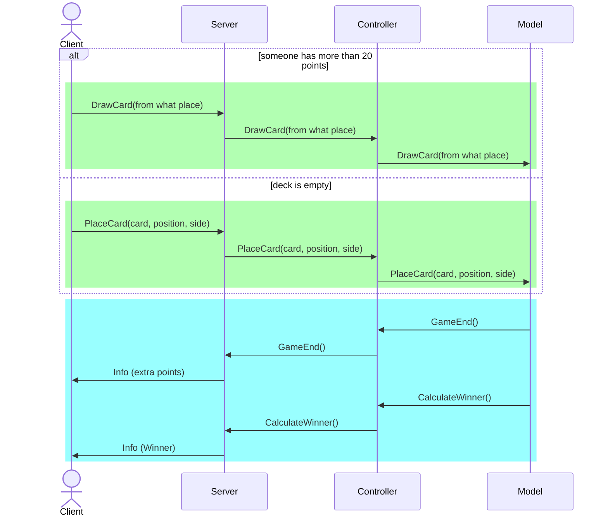
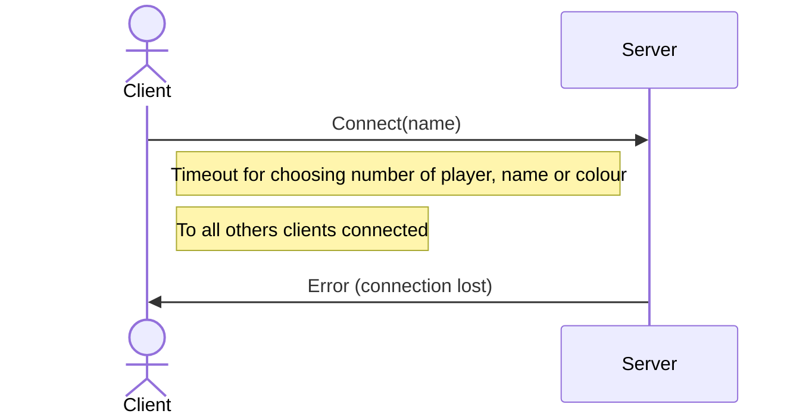
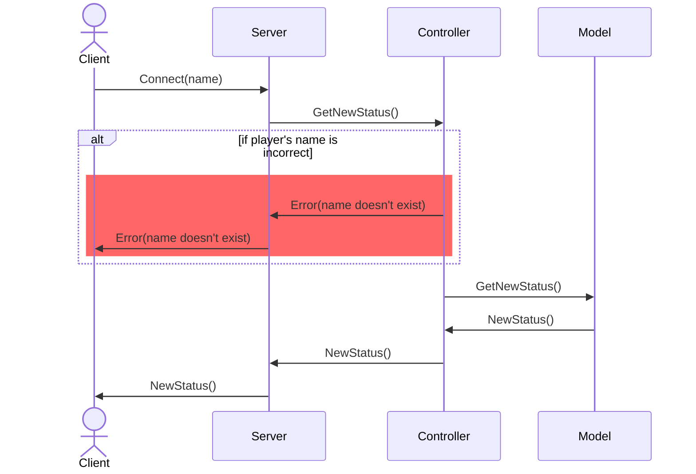

# Connection diagrams

## Login
Login phase illustrates the interaction between the client and server before the creation of the game.
The client sends a ping to the server to establish a connection. The server checks:

1. Lobby is locked, so the game already started
2. The player is first, so he/she can create the game. 

While the first player decide the number of players, other clients are put in waiting state.
When the lobby is created, the server must notify the clients to choose username and colour. And when the last player 
confirms username and colour the game starts.

## Game Start
When the last player joins the lobby, the server must notify the clients that the game is about to start. 
This transaction is not figured here for simplicity. 
The server must  notify the clients of the starting card and the common objectives. 
The server must also notify the clients of the cards in the player's hand and the player turn order.

The green box represents the choose of starting card while the blue one is about choosing objective card.

## Game Flow
The game flow is the main part of the game. 
The player can place and draw cards. The server must notify the clients of the player's turn and the table cards status.

## End Game

During the end game, the turns are the same as in the game flow, just the server must notify the players of the fact that the game is about to end.
This can happen when the deck is empty or someone has reached more than 20 points. Our implementations checks it after each turn:
    
1. After each turn when someone draws a card
2. When deck is empty, we check this after the place phase

The two case are represented in the green box. Note: in a game just one of two can happen.

The blue part is the end game phase. 
The server must notify the clients of the extra points(objective card's points) and the winner.

## Connection Lost
We implement "FA resilienza alle disconessioni", so the game can continue even if a player loses the connection.
Here is our implementation of the connection lost:
1. If a client loose connection during pregame, before choosing the colour, the server must notify the 
other clients that the player has disconnected. The game is closed.

2. If client lose connection during the game, the server randomly choose what happens to the player status.
So we can have four cases based on when a client disconnects:
    1. chooseStartingCard
    2. chooseObjectiveCard
    3. placeCard and consequently after "drawCard"
    4. drawCard 

In all the case, the server can modify autonomously the player status, in the model. When the player reconnects, 
the server must notify the client of the new status. 

